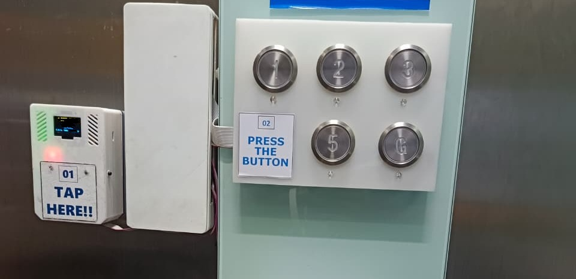
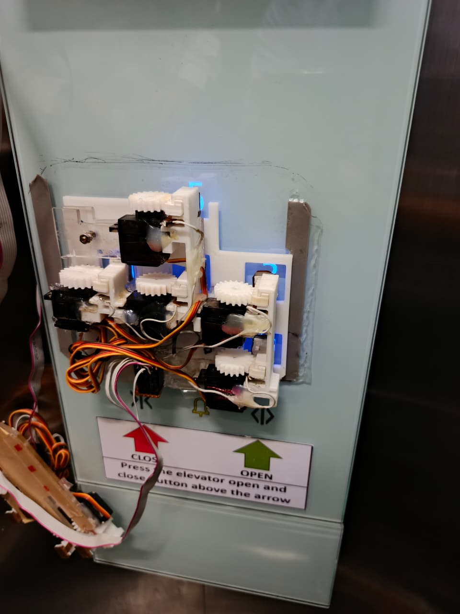

# RFID Lift Access Control

A smart elevator access control system that combines RFID authentication with IoT connectivity to enhance building security. The solution allows administrators to manage user access through a web interface while ensuring that only authorized users can operate designated elevator floors.

## Project Gallery

 |  |

## Read More

A detailed explanation of this project is available on Medium:

🔗 https://medium.com/@insan_/inovasi-sistem-keamanan-lift-menggunakan-rfid-wemos-dan-arduino-mega-untuk-kontrol-akses-yang-e49af0c8c8e2
